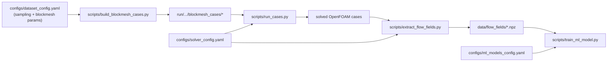

# Airfoil Surrogate Pipeline

## Přehled

Aktuální pipeline je postavená na **blockMesh-only** workflow:
- generování sampling tabulky,
- build case složek se syntetickým `blockMeshDict`,
- OpenFOAM běh,
- extrakce polí do NPZ,
- ML trénink.

Historická STL/snappy větev už není aktivní.

---

## End-to-end flow



---

## Hlavní skripty

### 1) Build case složek

- script: [scripts/build_blockmesh_cases.py](../scripts/build_blockmesh_cases.py)
- používá:
  - [configs/paths.yaml](../configs/paths.yaml)
  - [configs/dataset_config.yaml](../configs/dataset_config.yaml)

Co dělá:
- zajistí složky pro geometrii/sampling,
- pokud chybí sampling CSV, vygeneruje ho přes [src/generate_sampling_table.py](../src/generate_sampling_table.py),
- postaví `blockmesh_cases` ze šablony,
- zapíše `params.json` a zrcadlí case do OpenFOAM run lokace.

### 2) CFD běh

- script: [scripts/run_cases.py](../scripts/run_cases.py)
- runner: [src/case_runner.py](../src/case_runner.py)
- konfigurace: [configs/solver_config.yaml](../configs/solver_config.yaml)

Řetěz kroků je plně konfigurovatelný (aktuálně `blockMesh -> checkMesh -> decomposePar -> simpleFoam -parallel -> reconstructPar`).

### 3) Extrakce polí

- script: [scripts/extract_flow_fields.py](../scripts/extract_flow_fields.py)
- modul: [src/flow_extractor.py](../src/flow_extractor.py)

Co dělá:
- spustí `foamToVTK` (command je v [configs/solver_config.yaml](../configs/solver_config.yaml)),
- načte `p` a `U` z VTK,
- interpoluje na pravidelnou mřížku,
- vytvoří `fluid_mask`,
- uloží `.npz` a index CSV.

### 4) ML trénink

- script: [scripts/train_ml_model.py](../scripts/train_ml_model.py)
- modely: [src/ml_models.py](../src/ml_models.py)
- config: [configs/ml_models_config.yaml](../configs/ml_models_config.yaml)

Všechny hlavní ML parametry jsou v YAML (model, architektura, hyperparametry, physics loss, output).

---

## Sdílené moduly

| Modul | Účel |
|---|---|
| [src/config.py](../src/config.py) | načítání `paths`, `dataset`, `solver`, `ml_models` configu |
| [src/sampling.py](../src/sampling.py) | načtení sampling CSV do `BuildCaseRow` |
| [src/case_builder.py](../src/case_builder.py) | build jednoho blockMesh case |
| [src/blockmesh_generator.py](../src/blockmesh_generator.py) | generování `blockMeshDict` |
| [src/file_editors.py](../src/file_editors.py) | úpravy `0/U` a `system/forceCoeffs` |
| [src/case_runner.py](../src/case_runner.py) | spouštění OpenFOAM příkazů + logy + statusy |
| [src/flow_extractor.py](../src/flow_extractor.py) | VTK čtení/interpolace/maska/NPZ export |

---

## Quick Start

```bash
python -m scripts.build_blockmesh_cases
python -m scripts.run_cases
python -m scripts.extract_flow_fields
python -m scripts.train_ml_model
```

---

## Konfigurační soubory

- [configs/paths.yaml](../configs/paths.yaml)
- [configs/dataset_config.yaml](../configs/dataset_config.yaml)
- [configs/solver_config.yaml](../configs/solver_config.yaml)
- [configs/ml_models_config.yaml](../configs/ml_models_config.yaml)
