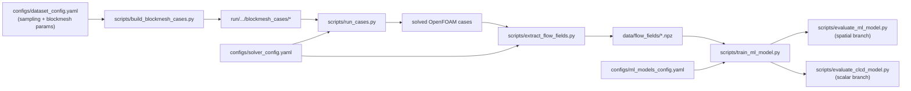

# Airfoil Surrogate Pipeline

## Overview

The active project flow is a blockMesh-only workflow:
- sampling table generation,
- OpenFOAM case build with generated `blockMeshDict`,
- CFD run,
- flow-field extraction to NPZ,
- ML training and evaluation.

The legacy STL/snappyHexMesh branch is not part of the current pipeline.

## End-to-end flow



## Main scripts

### 1) Build case folders

- script: [scripts/build_blockmesh_cases.py](../scripts/build_blockmesh_cases.py)
- uses:
  - [configs/paths.yaml](../configs/paths.yaml)
  - [configs/dataset_config.yaml](../configs/dataset_config.yaml)

What it does:
- ensures geometry/sampling folders exist,
- auto-generates the sampling CSV via [src/generate_sampling_table.py](../src/generate_sampling_table.py) if missing,
- builds `blockmesh_cases` from the selected template,
- writes `params.json` for each case,
- mirrors built cases to the OpenFOAM simulation location.

### 2) Run CFD

- script: [scripts/run_cases.py](../scripts/run_cases.py)
- runner: [src/case_runner.py](../src/case_runner.py)
- config: [configs/solver_config.yaml](../configs/solver_config.yaml)

The run-step chain is config-driven (currently:
`blockMesh -> checkMesh -> decomposePar -> simpleFoam -parallel -> reconstructPar -latestTime`).

Current runner behavior:
- writes per-step logs under each case `logs/` folder,
- stores global status summary (`run_status.csv`),
- removes `processor*` folders after each case finishes to reduce disk usage.

### 3) Extract flow fields

- script: [scripts/extract_flow_fields.py](../scripts/extract_flow_fields.py)
- module: [src/flow_extractor.py](../src/flow_extractor.py)

What it does:
- runs `foamToVTK` (command from [configs/solver_config.yaml](../configs/solver_config.yaml)),
- reads `p` and `U` from VTK,
- interpolates to a regular grid,
- creates `fluid_mask`,
- exports `.npz` files and dataset index CSV.

Current extraction grid in the script:
- `nx=640`, `ny=320`
- `x in [-0.75, 1.75]`
- `y in [-0.75, 0.75]`

### 4) Train ML model

- script: [scripts/train_ml_model.py](../scripts/train_ml_model.py)
- models: [src/ml_models.py](../src/ml_models.py)
- config: [configs/ml_models_config.yaml](../configs/ml_models_config.yaml)

The training script is config-driven for model selection, model parameters,
optimizer settings, training split, physics-loss settings, and output naming.

Two ML branches are supported:

1. Spatial branch (`simple_unet`, `rans_pinn`):
  - trains from NPZ flow fields,
  - predicts `(p, Ux, Uy)` maps,
  - evaluated by [scripts/evaluate_ml_model.py](../scripts/evaluate_ml_model.py).

2. Scalar branch (`clcd_mlp`):
  - trains from robustly parsed OpenFOAM `forceCoeffs.dat`,
  - predicts `[Cl, Cd]`,
  - evaluated by [scripts/evaluate_clcd_model.py](../scripts/evaluate_clcd_model.py).

During scalar training, invalid CFD outputs are filtered out (finite-value checks,
minimum valid iterations, safe normalization checks, non-finite loss guards).

Checkpoint for scalar branch stores:
- `model_name`
- `model_state_dict`
- `feature_mean`, `feature_std`
- `target_mean`, `target_std`
- `feature_order`, `target_order`
- `train_indices`, `val_indices`

Evaluation prefers split metadata from checkpoint (`val_case_ids` first, then `val_indices`),
and only rebuilds split from seed as last fallback.

## Shared modules

| Module | Purpose |
|---|---|
| [src/config.py](../src/config.py) | loading `paths`, `dataset`, `solver`, and `ml_models` YAML configs |
| [src/sampling.py](../src/sampling.py) | parsing sampling CSV into `BuildCaseRow` objects |
| [src/case_builder.py](../src/case_builder.py) | building one blockMesh case folder |
| [src/blockmesh_generator.py](../src/blockmesh_generator.py) | generating `blockMeshDict` |
| [src/file_editors.py](../src/file_editors.py) | updating `0/U` and `system/forceCoeffs` |
| [src/case_runner.py](../src/case_runner.py) | OpenFOAM command execution, logs, run statuses, processor cleanup |
| [src/flow_extractor.py](../src/flow_extractor.py) | VTK loading, interpolation, mask generation, NPZ export |
| [src/ml_clcd_dataset.py](../src/ml_clcd_dataset.py) | robust Cl/Cd dataset from forceCoeffs |
| [src/clcd_inference.py](../src/clcd_inference.py) | reusable scalar inference API |
| [src/evaluate_clcd_metrics.py](../src/evaluate_clcd_metrics.py) | scalar per-case/global metrics |
| [src/evaluate_clcd_plotting.py](../src/evaluate_clcd_plotting.py) | scalar evaluation plots |

## Quick Start

```bash
python -m scripts.build_blockmesh_cases
python -m scripts.run_cases
python -m scripts.extract_flow_fields
python -m scripts.train_ml_model
python -m scripts.evaluate_ml_model
python -m scripts.evaluate_clcd_model
```

## Configuration files

- [configs/paths.yaml](../configs/paths.yaml)
- [configs/dataset_config.yaml](../configs/dataset_config.yaml)
- [configs/solver_config.yaml](../configs/solver_config.yaml)
- [configs/ml_models_config.yaml](../configs/ml_models_config.yaml)
