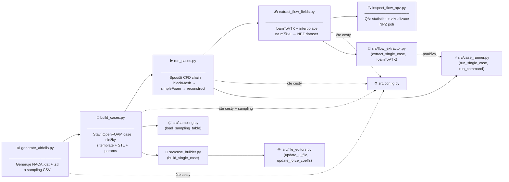

# Airfoil Surrogate Pipeline

## Přehled

Projekt generuje CFD dataset: z parametrů profilu NACA přes OpenFOAM simulace až po strukturované pole tlaku a rychlosti v NPZ formátu.

## Blokový diagram - Vztahy mezi skripty



---

## Popis hlavních skriptů

### 1️⃣ `generate_airfoils.py`
**Cíl:** Generovat geometrii profilů NACA a sampling tabulku

**Co dělá:**
- Počítá NACA 4-digit profily podle parametrů (camber, position, thickness)
- Exportuje `.dat` (text souřadnice) a `.stl` (3D triangulované)
- Zapisuje `airfoil_sampling_table.csv` s parametry všech případů

**Vstupy:**
- `configs/paths.yaml` (cesty)

**Výstupy:**
- `data/geometry/generated_profiles/nacaXXXX.dat`
- `data/geometry/generated_profiles/nacaXXXX.stl`
- `data/geometry/generated_profiles/airfoil_sampling_table.csv`

**Run:** 
```bash
python -m scripts.generate_airfoils
```

---

### 2️⃣ `build_cases.py`
**Cíl:** Připravit OpenFOAM case složky z šablony

**Co dělá:**
- Načte `sampling_table.csv`
- Pro každý řádek: zkopíruje template OpenFOAM case
- Vloží příslušné `.stl` do `constant/triSurface/`
- Upraví vstupní soubory (`0/U`, `system/forceCoeffs`)
- Zapíše `params.json` s metadaty případu

**Závislosti:**
- `src.config` → cesty a konfigurace
- `src.sampling` → čtení `airfoil_sampling_table.csv`
- `src.case_builder` → logika stavby
- `src.file_editors` → úpravy boundary conditions

**Vstupy:**
- `templates/openfoam_base_case/` (šablona)
- `data/geometry/generated_profiles/airfoil_sampling_table.csv`
- `data/geometry/generated_profiles/nacaXXXX.stl`

**Výstupy:**
- `run/airfoil_surrogate_cases/case_XXXX_nacaXXXX_aoaX_uX/`
  - `0/U` (upravené)
  - `system/forceCoeffs` (upravené)
  - `constant/triSurface/airfoil.stl`
  - `params.json`

**Run:**
```bash
python -m scripts.build_cases
```

---

### 3️⃣ `run_cases.py`
**Cíl:** Spustit CFD simulace pro všechny připravené případy

**Co dělá:**
- Najde všechny case složky v `openfoam_case_sim`
- Spouští CFD řetěz pro každý case:
  1. `blockMesh` – diskretizace domény
  2. `surfaceFeatures` – detekce hran profilu
  3. `snappyHexMesh` – adaptivní sítí kolem profilu
  4. `checkMesh` – validace sítě
  5. `decomposePar` – paralelizace
  6. `simpleFoam` (parallel) – RANS simulace
  7. `reconstructPar` – seskupení výstupů

- Zapisuje status a doby běhu do `run_status.csv`

**Závislosti:**
- `src.config` → cesty
- `src.case_runner` → spouštění příkazů a logika

**Vstupy:**
- `run/airfoil_surrogate_cases/case_XXXX_*/` (case složky)

**Výstupy:**
- `run/airfoil_surrogate_cases/case_XXXX_*/logs/*.log` (logy každého kroku)
- `run/airfoil_surrogate_cases/run_status.csv` (shrnutí běhů)
- Convergované výsledky v každé case složce

**Run:**
```bash
python -m scripts.run_cases
```

**Poznámka:** `MAX_WORKERS=1` – postupný běh. Lze zvýšit na 2-4 pro parallelní simulace.

---

### 4️⃣ `extract_flow_fields.py`
**Cíl:** Extrahovat pole z hotových simulací do strukturovaného NPZ datasetu

**Co dělá:**
- Pro každou hotovou case:
  1. Spustí `foamToVTK` → konverze na `.vtk`
  2. Čte VTK: body, tlak `p`, rychlost `U`
  3. Interpoluje na pravidelnou mřížku (default: 256 × 128)
  4. Vytvoří masku solidních pixelů (z NACA profilu)
  5. Uloží do NPZ (komprimované NumPy):
     - `xy` – souřadnice mřížky
     - `p` – tlak
     - `U` – rychlost (2D vektor)
     - `fluid_mask` – kde je tekutina (1) vs. pevná tělesa (0)

- Zapíše index CSV: metadata všech extrahovaných polí

**Závislosti:**
- `src.config` → cesty
- `src.flow_extractor` → extrakce a interpolace
- `src.case_runner` → spouštění `foamToVTK`

**Vstupy:**
- `run/airfoil_surrogate_cases/case_XXXX_*/` (case s konvergovaným řešením)

**Výstupy:**
- `data/flow_fields/case_XXXX_nacaXXXX_*.npz` (komprimovaná pole)
- `data/flow_fields/flow_dataset_index.csv` (metadata)

**Run:**
```bash
python -m scripts.extract_flow_fields
```

---

### 5️⃣ `inspect_flow_npz.py`
**Cíl:** Kvalitativní kontrola extrahovaného datasetu

**Co dělá:**
- Čte NPZ soubory
- Tiskne statistiky: min, max, mean, std, NaN count
- Vykresluje heatmapy tlaku, rychlosti a masky
- Užitečné pro QA a debugování

**Vstupy:**
- `data/flow_fields/*.npz`

**Run:**
```bash
python -m scripts.inspect_flow_npz
```

---

## Sdílené moduly

| Modul | Účel |
|-------|------|
| `src/config.py` | Loader `paths.yaml` – centralizuje všechny cesty |
| `src/sampling.py` | Čtení sampling tabulky (`BuildCaseRow`) |
| `src/case_builder.py` | Stavba jedné case: template + STL + edits + JSON |
| `src/file_editors.py` | Regex editory OpenFOAM souborů (U, forceCoeffs) |
| `src/case_runner.py` | Spouštění příkazů přes Cygwin bash + log management |
| `src/flow_extractor.py` | Čtení VTK, interpolace, maska, NPZ zápis |

---

## Sled operací (Quick Start)

```bash
# 1. Vygeneruj profily + sampling tabulka
python -m scripts.generate_airfoils

# 2. Postav OpenFOAM case složky
python -m scripts.build_cases

# 3. Spusť simulace
python -m scripts.run_cases

# 4. Extrahuj pole do NPZ
python -m scripts.extract_flow_fields

# 5. Zkontroluj výsledky
python -m scripts.inspect_flow_npz
```

---

## Konfigurace

Všechny cesty jsou v `configs/paths.yaml`:
- `project_root_windows` – kořen projektu
- `template_case_windows` – šablona OpenFOAM
- `generated_profiles_windows` – výstup profilů
- `openfoam_run_root_windows` – kde se budují case
- `openfoam_bash_windows` – cesta na Cygwin bash (pro spouštění OF)

