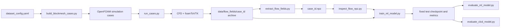

# Airfoil Surrogate Pipeline

## End-to-end tok


```mermaid
flowchart LR
    A[dataset_config.yaml] --> B[build_blockmesh_cases.py]
    B --> C[OpenFOAM simulation cases]
    C --> D[run_cases.py]
    D --> E[CFD + foamToVTK]
    E --> F[data/flow_fields/case_id archive]
    F --> G[extract_flow_fields.py]
    G --> H[case_id.npz]
    H --> I[inspect_flow_npz.py]
    I --> J[train_ml_model.py]
    F --> J
    J --> K[fixed test checkpoint and metrics]
    K --> L[evaluate_ml_model.py]
    K --> M[evaluate_clcd_model.py]
```

Spatial větev používá NPZ z kroku extrakce. `clcd_mlp` používá `postProcessing/forceCoeffs1/0/forceCoeffs.dat` ze stejného case archivu a NPZ nepotřebuje.

## 1. Build cases

[scripts/build_blockmesh_cases.py](../scripts/build_blockmesh_cases.py):

1. vždy regeneruje sampling CSV z `dataset_config.yaml`;
2. smaže existující podadresáře ve spravovaném run rootu;
3. vytvoří jeden case pro každý sampling řádek;
4. smaže existující podadresáře v simulation mirroru;
5. zkopíruje nové cases do OpenFOAM simulačního umístění.

Každý case dostane generovaný `system/blockMeshDict`, upravené `0/U`, upravené `system/forceCoeffs` a `params.json`.

## 2. Run CFD, conversion and archive

[scripts/run_cases.py](../scripts/run_cases.py) hledá validní cases v `openfoam_case_sim_windows/<cases_subdir>`. Zpracuje pouze názvy odpovídající `case_<číselné-id>_...`; pomocí `--start-case-id N` lze spustit pouze ID `N` a vyšší.

Řetězec příkazů je definován v `solver_config.yaml`:

```text
blockMesh
checkMesh
decomposePar -force
simpleFoam -parallel
reconstructPar -latestTime
foamToVTK -latestTime -ascii -fields '(p U)'
```

Runner:

- zapisuje log každého kroku do `logs/`;
- ukončí zjevně divergentní `simpleFoam`, pokud lineární solver dosáhne 1000 iterací a vrátí NaN/Inf nebo reziduum alespoň `1e2`;
- po úspěchu zkopíruje `logs`, `postProcessing`, `system`, `VTK`, poslední numerický time adresář a `params.json` do `flow_fields_output/<case_id>`;
- archiv nepřepisuje – existující cílový adresář způsobí selhání `target_exists`;
- po úspěšné archivaci odstraní pracovní simulation case;
- při dřívějším selhání odstraňuje `processor*`; při selhání VTK/archivace case ponechá pro kontrolu;
- zapisuje `run_status.csv` do kořene simulačních cases.

## 3. Extract regular-grid fields

[scripts/extract_flow_fields.py](../scripts/extract_flow_fields.py) čte archivované cases z `flow_fields_output`. `foamToVTK` již nespouští; očekává VTK vytvořené runnerem.

Pro každý case:

- vybere poslední time a odpovídající VTK;
- načte `p` a `U`;
- interpoluje je na mřížku `640 × 320`, `x=[-0.75, 1.75]`, `y=[-0.75, 0.75]`;
- vytvoří `fluid_mask` z NACA geometrie;
- odmítne fyzikálně neplausibilní pole;
- uloží komprimované `<case_id>/<case_id>.npz`.

Souhrn všech výsledků je `flow_fields_output/flow_dataset_index.csv`. Konstanty mřížky a `MAX_WORKERS=1` jsou aktuálně ve skriptu, nikoli v YAML.

## 4. Inspect and filter

[scripts/inspect_flow_npz.py](../scripts/inspect_flow_npz.py) kontroluje tvar, finite hodnoty, rozsahy polí a rezidua ze solver logu. Vytváří `inspect_plausibility.csv` a diagnostické obrázky. [src/ml_dataset.py](../src/ml_dataset.py) i [src/ml_clcd_dataset.py](../src/ml_clcd_dataset.py) načítají seznam nevyhovujících cases a vynechají je.

## 5. Train reproducible experiment

[scripts/train_ml_model.py](../scripts/train_ml_model.py) podporuje `simple_unet`, `rans_pinn` a `clcd_mlp`.

Společný protokol:

1. vytvořit nebo načíst `fixed_test_split.json`;
2. na development datech provést jeden holdout nebo K-fold CV;
3. volitelně porovnat konfigurace hyperparametrů;
4. vybrat nejlepší konfiguraci bez použití test setu;
5. znovu natrénovat na celé development části;
6. jednou vyhodnotit fixed test set a uložit checkpoint i metadata.

Změna fingerprintu datasetu zastaví běh. Explicitní `--regenerate-split` dovolí vytvořit nový fixed test split.

## 6. Evaluate checkpoint

- [scripts/evaluate_ml_model.py](../scripts/evaluate_ml_model.py): pole `p`, `Ux`, `Uy`, per-case/global metriky a diagnostické grafy;
- [scripts/evaluate_clcd_model.py](../scripts/evaluate_clcd_model.py): Cl/Cd metriky a scatter/residual/error grafy.

U nového checkpointu oba skripty používají uložená `test_case_ids` a checkpoint normalizaci. Legacy checkpointy mají fallback na starý validační split.

## Příkazy

```powershell
python -m scripts.build_blockmesh_cases
python -m scripts.run_cases
python -m scripts.extract_flow_fields
python -m scripts.inspect_flow_npz
python -m scripts.train_ml_model --model simple_unet
python -m scripts.evaluate_ml_model
```

Pro scalar větev nahraďte poslední dva příkazy:

```powershell
python -m scripts.train_ml_model --model clcd_mlp
python -m scripts.evaluate_clcd_model
```
